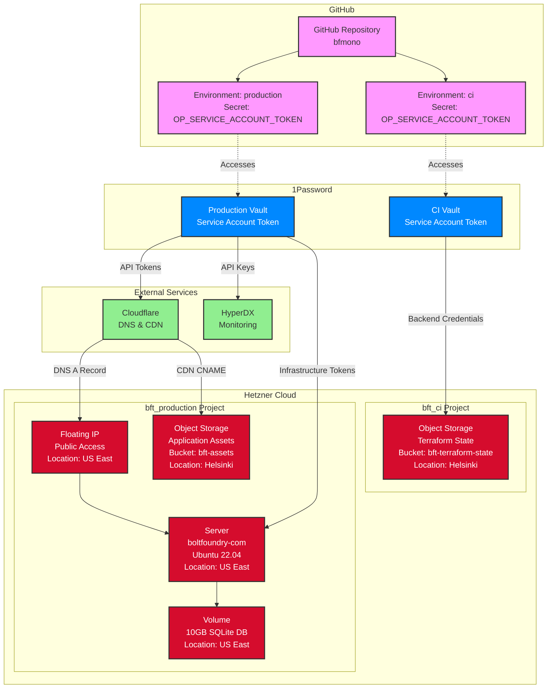
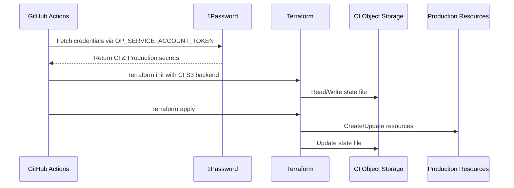
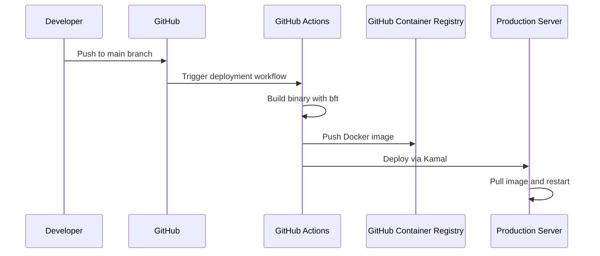
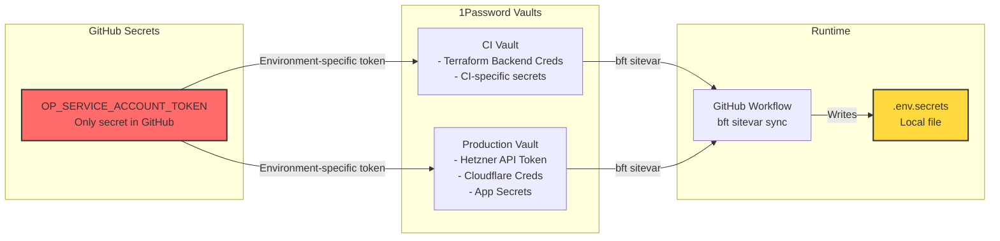
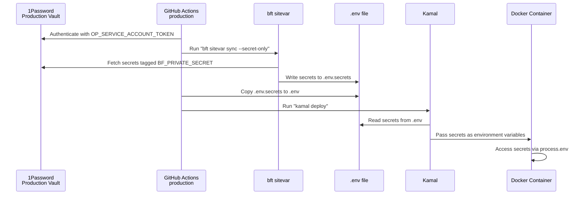

# Infrastructure Architecture

## Overview

This diagram shows the complete infrastructure setup across two Hetzner
projects, GitHub environments, and 1Password vaults.



## Data Flow

### 1. Terraform State Management



### 2. Application Deployment



## Security Architecture

### Secret Management Flow



## Resource Separation

| Component               | CI Project | Production Project | Location | Purpose                           |
| ----------------------- | ---------- | ------------------ | -------- | --------------------------------- |
| Terraform State         | ✅         | ❌                 | Helsinki | Isolated from production failures |
| Application Servers     | ❌         | ✅                 | US East  | Production workloads              |
| Object Storage (State)  | ✅         | ❌                 | Helsinki | Terraform state backend           |
| Object Storage (Assets) | ❌         | ✅                 | Helsinki | Application files and media       |
| Floating IPs            | ❌         | ✅                 | US East  | Public access points              |
| Volumes                 | ❌         | ✅                 | US East  | Database storage                  |

## How Secrets Flow to Production

### Overview

Production secrets follow a secure path from 1Password to running containers
without being exposed in logs, images, or repositories.

### Secret Flow Process



### Implementation Details

1. **1Password Setup** (One-time):
   ```bash
   # Store secrets in Production vault with BF_PRIVATE_SECRET tag
   bft sitevar secret set DATABASE_URL "postgres://..."
   bft sitevar secret set OPEN_AI_API_KEY "sk-..."
   # etc.
   ```

2. **Kamal Configuration** (`deploy.yml.tpl`):
   ```yaml
   env:
     clear:
       # Non-sensitive config
       PORT: 8000
       BF_ENV: production
     secret:
       # Sensitive values read from .env file
       - DATABASE_URL
       - OPEN_AI_API_KEY
       - ASSEMBLY_AI_KEY
       # etc.
   ```

3. **Deployment Workflow**:
   - GitHub Actions authenticates to 1Password using environment-specific token
   - `bft sitevar sync` pulls all secrets to `.env.secrets`
   - Secrets are passed to Kamal via `.env` file
   - Kamal injects them as environment variables in containers

### Security Guarantees

- ✅ **No secrets in Git**: Only `OP_SERVICE_ACCOUNT_TOKEN` in GitHub
- ✅ **No secrets in images**: Docker images contain no secrets
- ✅ **No secrets in logs**: Kamal masks sensitive values
- ✅ **Encrypted at rest**: 1Password handles encryption
- ✅ **Audit trail**: 1Password logs all access
- ✅ **Easy rotation**: Update in 1Password and redeploy

### Adding New Secrets

1. Add to 1Password:
   ```bash
   bft sitevar secret set NEW_SECRET "value"
   ```

2. That's it! The deployment process will:
   - Run `bft sitevar sync` to pull all secrets
   - Run `bft generate-kamal-config` to dynamically update the Kamal config
   - Include your new secret automatically

The secret will automatically flow to production on the next deployment.

### How Dynamic Secret Generation Works

The `bft generate-kamal-config` task:

1. Reads all available secrets from `.env.secrets`
2. Filters out infrastructure-only secrets (like API tokens)
3. Automatically includes all runtime secrets in the Kamal config
4. No manual config updates needed when adding/removing secrets

## Benefits of This Architecture

1. **State Isolation**: Terraform state is physically separated from production
   resources
2. **Credential Separation**: Different service accounts for CI vs Production
3. **Single Secret**: Only `OP_SERVICE_ACCOUNT_TOKEN` needs to be in GitHub
4. **Audit Trail**: Clear separation of who accesses what
5. **Disaster Recovery**: Production issues can't corrupt Terraform state
6. **Cost Allocation**: Clear project boundaries for billing
